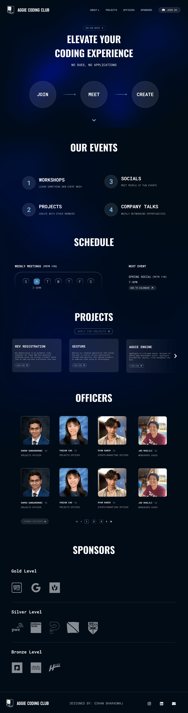

# Aggie Coding Club Website

This project is the redesign of the Aggie Coding Club website, aimed at providing an engaging and modern online presence for our coding community.

## Preview

## Technologies Used

<!-- prettier-ignore -->
| Technology | Purpose |
|------------|---------|
|  [Nuxt.js](https://nuxtjs.org/) | Vue meta-framework for building web applications |
|  [Vue.js](https://vuejs.org/) | JavaScript framework for building user interfaces |
|  [Shadcn/Vue](https://www.shadcn-vue.com/) | UI component library for Vue.js |
|  [Sanity](https://www.sanity.io/) | Headless CMS for content management |

## Contirbutors

- Eshan Bharadwaj
- ???

## License

This project is licensed under the [MIT License](LICENSE).

## Acknowledgments

Special thanks to the contributors and the Aggie Coding Club community for their valuable input and support in this redesign.
